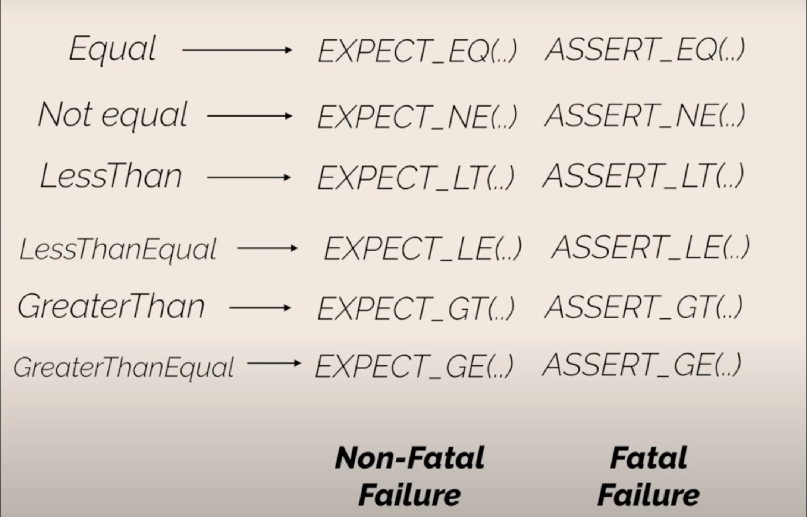

# GoogleTest with CMake

## Setup

```bash
mkdir build
cd build
cmake ..
make
ctest # run tests
```

---

## Assertions and Expectations



- Check if two strings are equal using `EXPECT_STREQ` & `ASSERT_STREQ`

- **Fatal Failures** - These are failures that cause the test to fail immediately.
- **Non-Fatal Failures** - These are failures that do not cause the test to fail immediately. It'll continue to run the rest of the test cases, but the test will be marked as failed.

> Then, why do we have non-fatal failures?

- Bcoz, it will try reporting all the failures, and we won't have to rerun the test cases again and again just to check if the test passed or not.

- Fatal errors mean, there's no point in running the rest of the test cases, as something went wrong.

---

## Fixtures

- If we have to run some setup and teardown code for a number of tests, we can create a fixture.

- Just create a class that inherits from `testing::Test` and override the `SetUp()` and `TearDown()` methods.
- Use `TEST_F` to run the tests. Just be sure, `TEST_F` can access the protected members of the fixture class.

```cpp
#include <gtest/gtest.h>

class MyFixture : public ::testing::Test
{
protected:
    int *x, *y;
    void SetUp() override
    {
        // Code here will be called immediately after the constructor (right
        // before each test).
        x = new int(21);
        y = new int(17);
    }
    void TearDown() override
    {
        // Code here will be called immediately after each test (right
        // before the destructor).
        free(x);
        free(y);
    }
};

TEST_F(MyFixture, Test1)
{
    int val = 4;
    EXPECT_EQ(*x-*y, val);
}

```

---

## Mocking in GoogleTest

https://google.github.io/googletest/gmock_for_dummies.html
